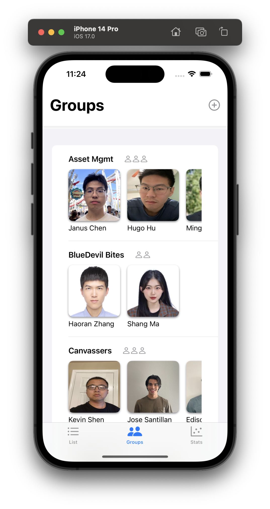
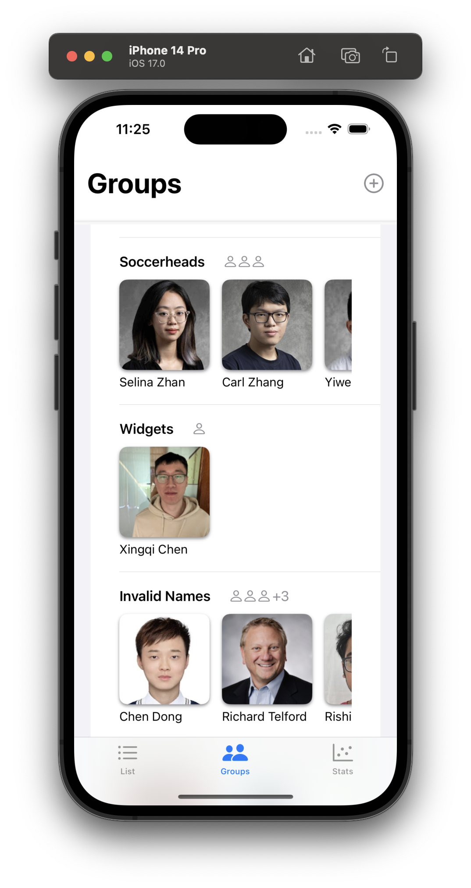
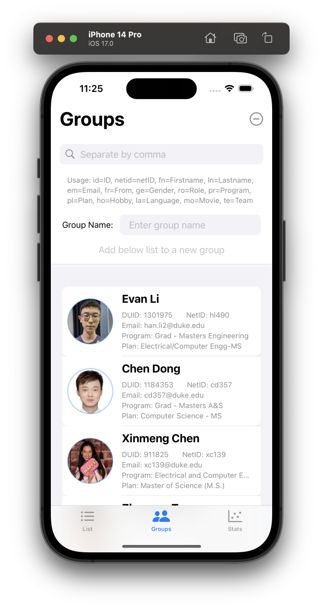
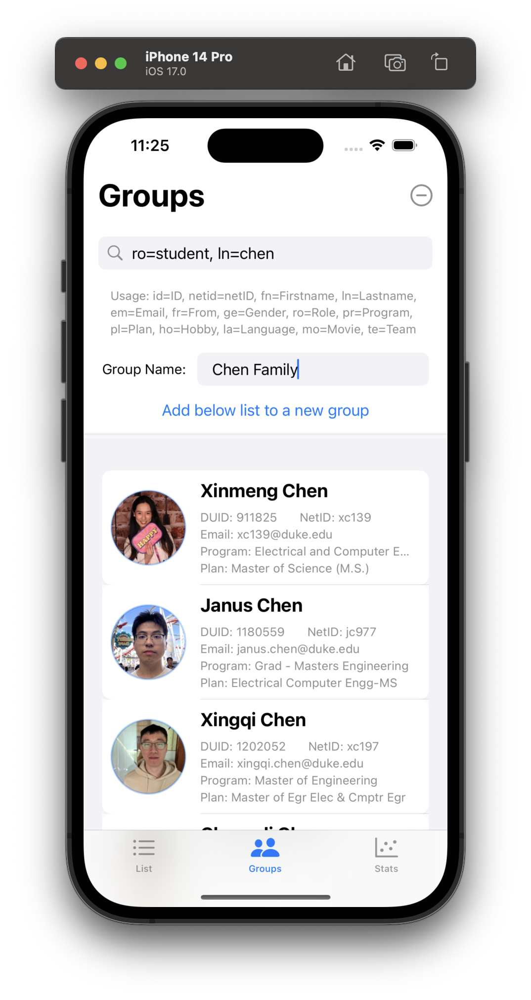
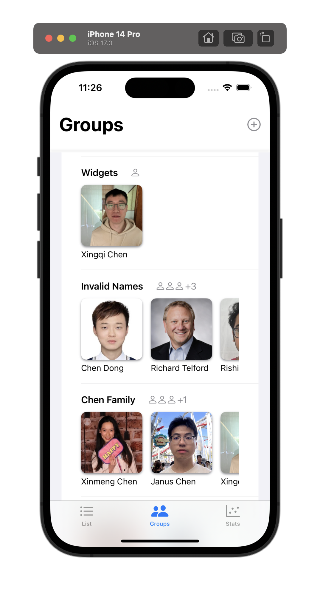
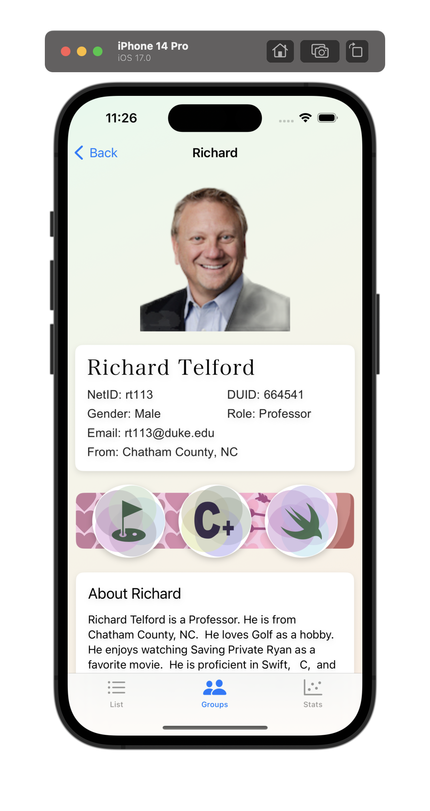
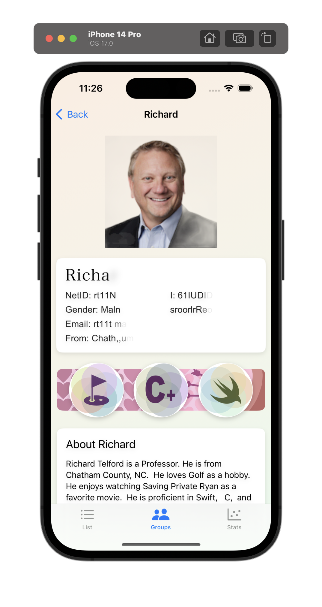
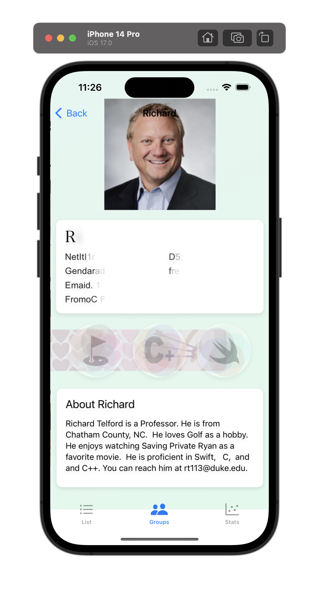

#  ECE564 HW6 - Tabs, Graphics, Animation

> **Please ignore some run-time warnings, they are from the BackgroundRemoval dependency. There's no errors or warning at the build-time.**

## Extra Functionality

### 1. More Advanced UI
- Group title uses the person icon to show the number of people in the group

### 2. More Advanced Search Page
- Search includes every fields and uses comma with "and" operation
- Real-time result shown in a list view
- Disable "create new group" button when the name is not entered

### 3. Very Complex Animations
- Fade-in-out animation to show the background Removal effect of the avatar
- Blur and randomlized text animation to show the basic information and names
- Transform animation to show the badge card and contents

### 4. Very Complex Graphics
- The badge background (six circles) is patinted by paths, as well as all those hobbies and languages shapes (18 kinds)
- Randomly generated colors for the badge backgroud and foreground


### 5. Use Badges to Represent Hobby and Languages
- Badges to map the hobbies and languages

| | | |
|---|---|---|
||||
||| |
|||||

<<<<<<< HEAD

=======
>>>>>>> 942c9167cc564733ede1228eefe2aae9b8509cad
<br />

## Code Reference

#### 1.Some parts of the code are generated by ChatGPT and Copilot plugin for Xcode

Code cooperated with AI includes:
- Convert Shapes to Views
- Use of Shapes
- Advanced Animations


#### 2. BackgroundRemoval

Discussed in previous projects

#### 3. [LocationPicker](https://github.com/alessiorubicini/LocationPickerForSwiftUI)

A library used support map view for location pick up


#### 4. Apple Documentation

- Styles of picker
- [MapKit](https://developer.apple.com/documentation/corelocation/clgeocoder/2890753-geocodeaddressstring)

<br />

## Previous Project Usage

### Main Page Help

```text
-- Initial Upload --
Upload your data to the server from the build-in JSON file

-- Updated Upload --
Update your remote profile with your local changes

-- Download Replace --
Clear your local data model, and fetch the entire records from the server

-- Download Update --
Merge your local data model with remote data

-- Replace One Only --
Replace your local specific one's profile with remote one

-- Load from Disk --
Discard all data in memory, and sysnc with local sandbox's data

-- Delete Myself --
Delete your profile from the server
```

### Input Instruction

```text
--------------------------------------- Help ---------------------------------------
Format:
fn=first_name, ln=last_name, em=email,
ro=role, ge=gender, fr=from
- ro must be one of: Student, TA, Professor, Staff, or will be Other
- ge must be one of: Male, Female, otherwise will be Other
- Either of these parameters must not contains ',', space, or '='
- The order of parameters does not matter

1. Add: Add a person to the database.
    DUID is required, all other parameters are optional.
2. Update: Update or add a person with given DUID.
    DUID is required, all other parameters are optional.
3. Delete: Delete a person with given DUID.
    DUID is required, all other parameters are ignored.
4. Find: Find a person with given DUID or given name.
    Either DUID or lName is required, fName is default with "*".
    Use "*" to represent any name. Not case sensitive.
5. List All: List all people in the database.
6. Help: Show this help message.

CopyRight: Yadong (Hugo) Hu, 2023
------------------------------------------------------------------------------------
```

### Test Cases

Please visit last homework's [README.md](https://gitlab.oit.duke.edu/yh342/ece564hw1/-/blob/main/README.md) for more details.


