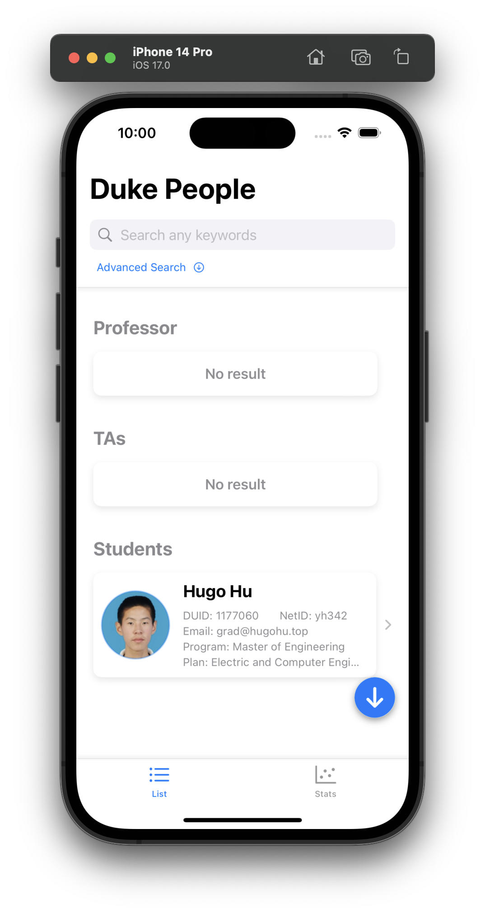
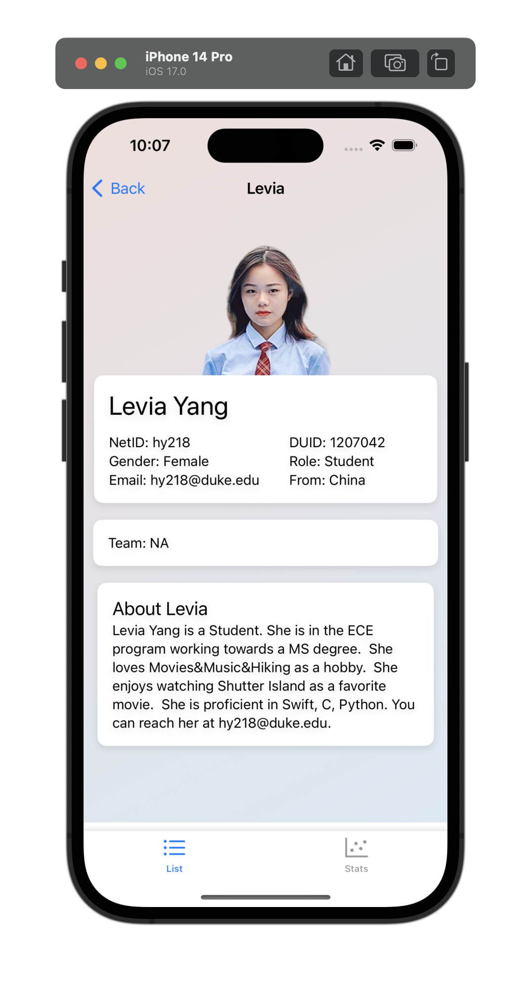
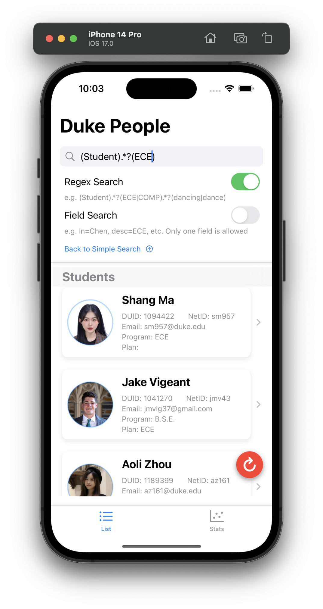
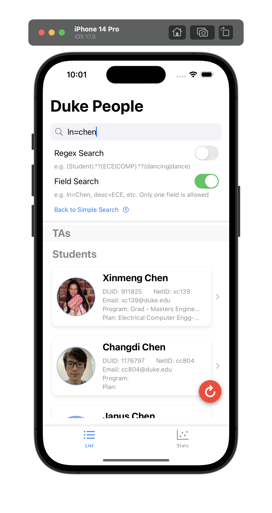
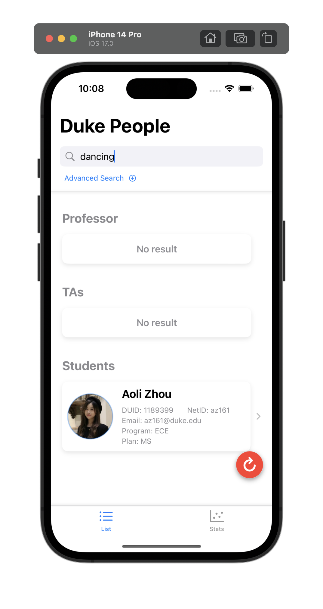
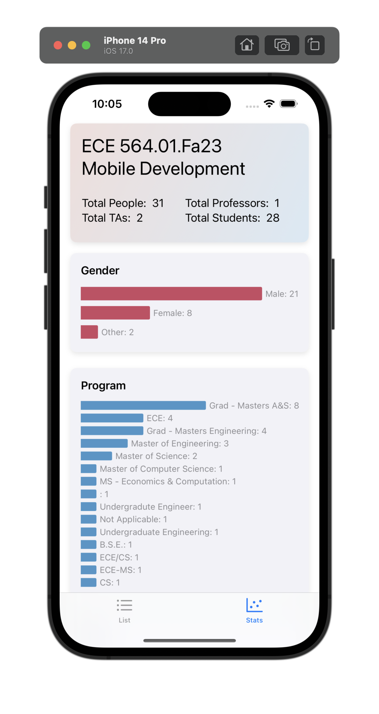
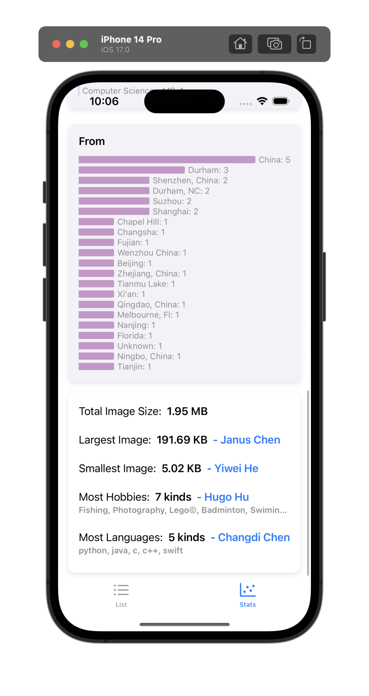

#  ECE564 HW4 - ListView

> **Please ignore some run-time warnings, they are from the BackgroundRemoval dependency. There's no errors or warning at the build-time.**


## Extra Functionality

### 1.The creativity of your List and DukePerson Views
- Very delicated and well-arranged (even product-level) layouts and views
- Support pull-to-refresh

||||
|---|---|---|

||||
|---|---|---|


### 2.More advanced search
- Support direct search in all fields within regular expression
 - e.g., "(Student).*?(ECE|COMP).*?(dancing|dance)" will find student in ECE or COMP who likes dancing
- Support field search
 - e.g., "ln=chen" will find all people whose last name is "chen"
 - Note: only one field search is allowed at a time, if the query is invalid, it will be ignored (all results will be shown)
 
||||
|---|---|---| 

### 3.Additional information to the user
- Statistics of the class
- Very beautiful and intuitive graphs

||||
|---|---|---| 


<br />

## Code Reference

#### 1.Some parts of the code are generated by ChatGPT and Copilot plugin for Xcode

Code cooperated with AI includes:
- Graph
- Search with regular expression
- Advanced feature like dynamic state animations


<br />

## Previous Project Usage

### Main Page Help

```text
-- Initial Upload --
Upload your data to the server from the build-in JSON file

-- Updated Upload --
Update your remote profile with your local changes

-- Download Replace --
Clear your local data model, and fetch the entire records from the server

-- Download Update --
Merge your local data model with remote data

-- Replace One Only --
Replace your local specific one's profile with remote one

-- Load from Disk --
Discard all data in memory, and sysnc with local sandbox's data

-- Delete Myself --
Delete your profile from the server
```

### Input Instruction

```text
--------------------------------------- Help ---------------------------------------
Format:
fn=first_name, ln=last_name, em=email,
ro=role, ge=gender, fr=from
- ro must be one of: Student, TA, Professor, Staff, or will be Other
- ge must be one of: Male, Female, otherwise will be Other
- Either of these parameters must not contains ',', space, or '='
- The order of parameters does not matter

1. Add: Add a person to the database.
    DUID is required, all other parameters are optional.
2. Update: Update or add a person with given DUID.
    DUID is required, all other parameters are optional.
3. Delete: Delete a person with given DUID.
    DUID is required, all other parameters are ignored.
4. Find: Find a person with given DUID or given name.
    Either DUID or lName is required, fName is default with "*".
    Use "*" to represent any name. Not case sensitive.
5. List All: List all people in the database.
6. Help: Show this help message.

CopyRight: Yadong (Hugo) Hu, 2023
------------------------------------------------------------------------------------
```

### Test Cases

Please visit last homework's [README.md](https://gitlab.oit.duke.edu/yh342/ece564hw1/-/blob/main/README.md) for more details.


